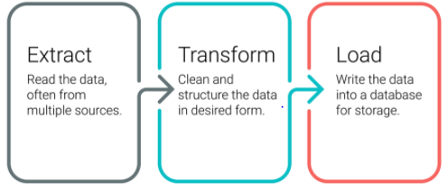
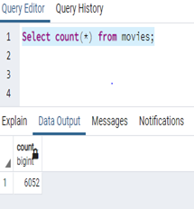
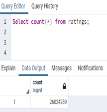
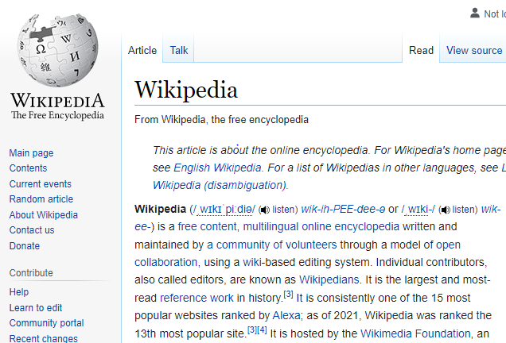

## Project Requirement

This project consists of three deliverables:

- Deliverable 1: Write an ETL Function to Read Three Data Files
- Deliverable 2: Extract and Transform the Wikipedia Data
- Deliverable 3: Extract and Transform the Kaggle data
- Deliverable 4: Create the Movie Database

The project as a whole is based on the ETL concept of Extract, Process and Load. There are unique concepts implemented in the code which include the development and use of functions, the parsing and cleaning of data using the Python Regular Expression set and the loading of processed and curated data to a persistent database (PostgreSQL).

The entire project is written in Python.

Deliverable 1 - ETL_function_test.ipynb

Deliverable 2 - ETL_clean_wiki_movies.ipynb

Deliverable 3 - ETL_clean_kaggle_data.ipynb

Deliverable 4 -  ETL_create_database.ipynb

### Artifacts provide for validating accuracy include

| Movies_query.png                                             | Ratings_query.png                                            | Rows inserted in movies db                                   |
| ------------------------------------------------------------ | ------------------------------------------------------------ | ------------------------------------------------------------ |
|  |  |  |
|                                                              |                                                              |                                                              |

## What is Kaggle? 

(All pictures protected by source other than this author)

## What is Wikipedia?

(All pictures in information protected by source other than this author)

